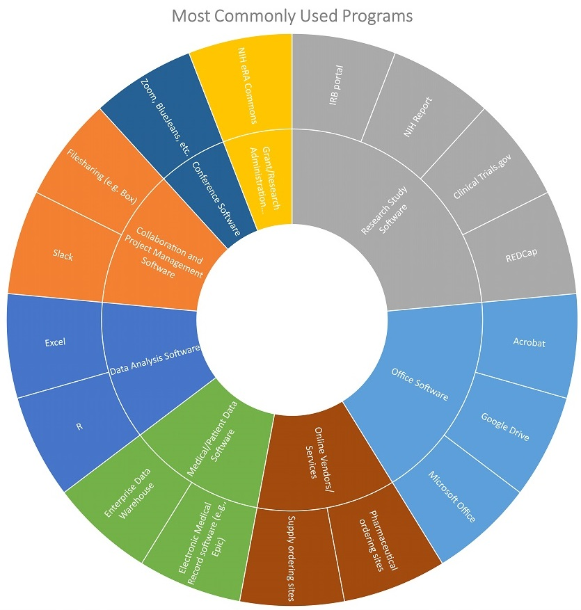

---
### Clinical Research Coordinator: Software usage

Lucy is a skilled spreadsheet user. She collects and manipulates data in tools like Excel, and uses many other tools in the research process including REDCap, funder and regulatory websites, institutional compliance portals, supply and drug ordering websites, and various collaboration and web conferencing tools. Lucy’s particular concerns are maintaining data safety and patient confidentiality, while also moving between sites and utilizing mobile tools. These requirements add an extra layer of challenges on many of her interactions with software.

##### Back to [Supplemental Information: Software Use](https://data2health.github.io/CTS-Personas/pages/software_use.html)
