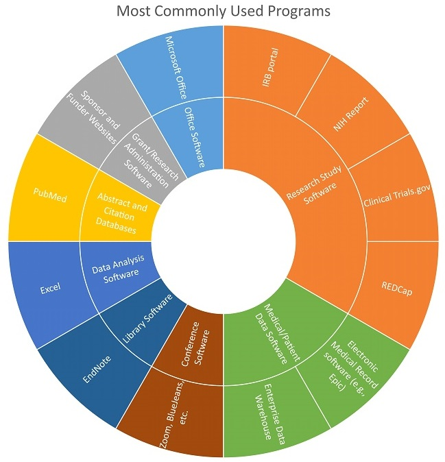

---
### Clinician/Researcher: Software usage

As a clinician/researcher, Simran’s usage of technology and software can be described as that of the desktop researcher. She uses PubMed Central to retrieve articles, REDCap, the EDW, electronic medical records, ClinicalTrials.gov, funder and sponsor websites in her research, and the Microsoft Office Suite for communication and collaboration. She sometimes receives assistance with these tools and with institutional portals such as the IRB, but she often handles requests for information directly.

##### Back to [Supplemental Information: Software Use](https://data2health.github.io/CTS-Personas/pages/software_use.html)
