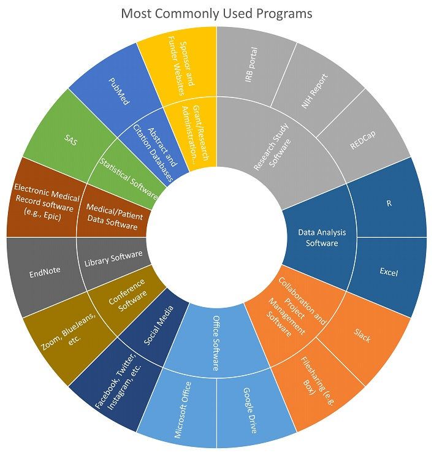

---
### Community-Engaged Faculty Investigator: Software usage

Greta’s usage of technology and software can be described as that of the desktop researcher. She uses PubMed Central to retrieve articles, REDCap, funder and sponsor websites in her research, and the Microsoft Office Suite for communication and collaboration. She is also dedicated to engagement with her community partners, and often achieves this through the use of collaboration tools such as social media, blogs, and video conferencing software. Mobile versions of all her software tools help her connect when she is on-site.

##### Back to [Profiles](index.md)
