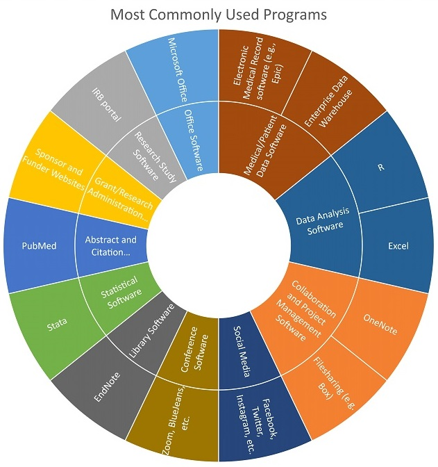

---
### KL2 Scholar: Software usage

Melody’s usage of technology and software can be described as that of the desktop researcher. Her KL2 research project is partially based on analysis of secondary datasets; therefore she is focused on tools that help her to retrieve and harmonize data, and that help her to collaborate with those who help her find and refine data. Melody also communicates frequently and sometimes over distances with mentors and members of her research team. She utilizes PubMed Central and EndNote frequently for her research.

##### Back to [Profiles](index.md)
