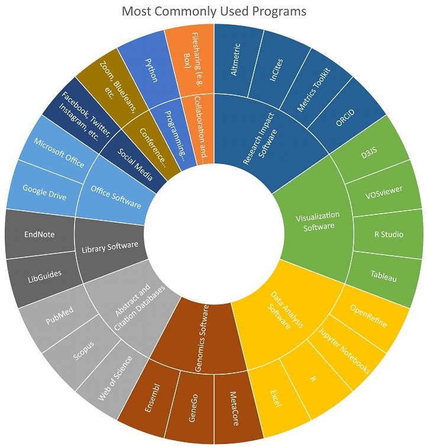

---
### Librarian: Software usage

Rachael is skilled in data visualization programs. She works in a smaller academic medical center library and her job combines aspects of what are commonly two jobs in the CTS library landscape: research impact librarian and bioinformatics librarian. In her bioinformatics role she largely uses online genomics tools such as Ensembl, GeneGo, and MetaCore. In her research impact role she queries multiple bibliographic databases and uses burgeoning research impact tools such as ORCiD, Metrics Toolkit, and InCites to collect information on researchers’ impact. She visualizes data collected through these tools with programs including Python, R Studio, Tableau, and VOSViewer.

##### Back to [Profiles](index.md)
