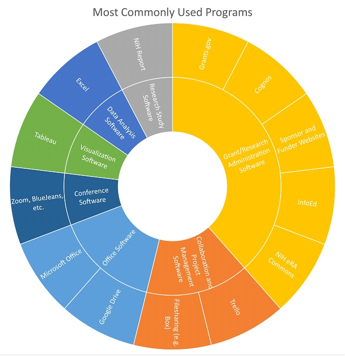

---
### Research Administrator: Software usage

Irene is a skilled spreadsheet user. Her pre-award administration responsibilities require her to gather and process a great amount of data in spreadsheets, including financial and budget data, time reporting data, and payroll data. Her expertise in organizing data from multiple sources helps keep research teams on track both within her organization and across organizations on multi-site studies. She produces visualizations in Tableau and wants to grow her skills in statistical analysis in order to take her financial management skills to a new level. 

##### Back to [Supplemental Information: Software Use](https://data2health.github.io/CTS-Personas/pages/software_use.html)
